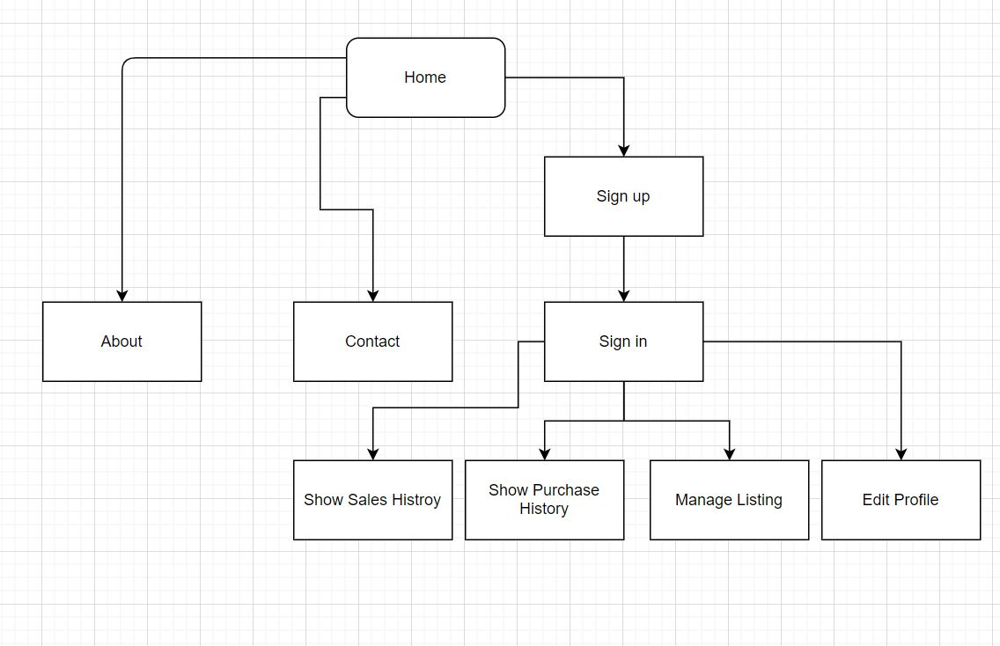
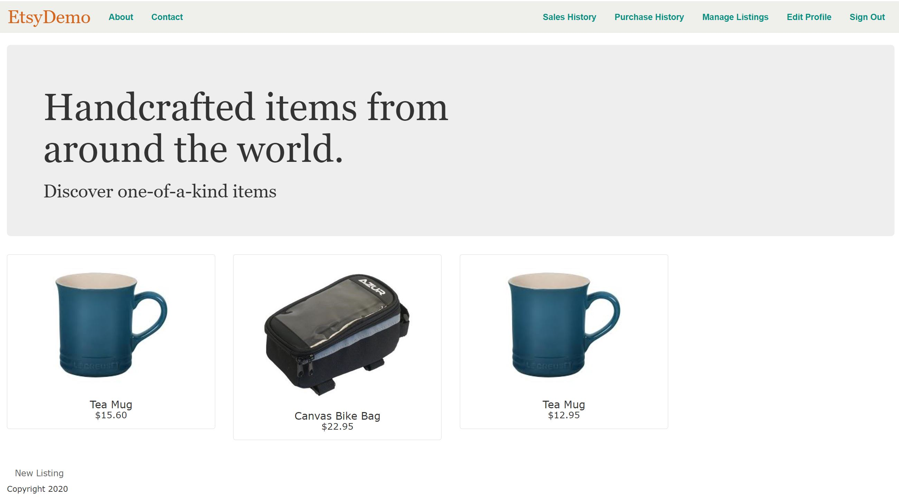
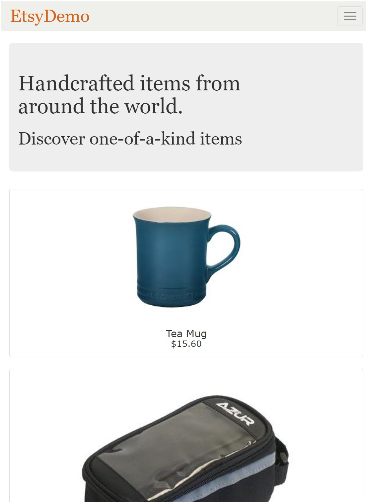
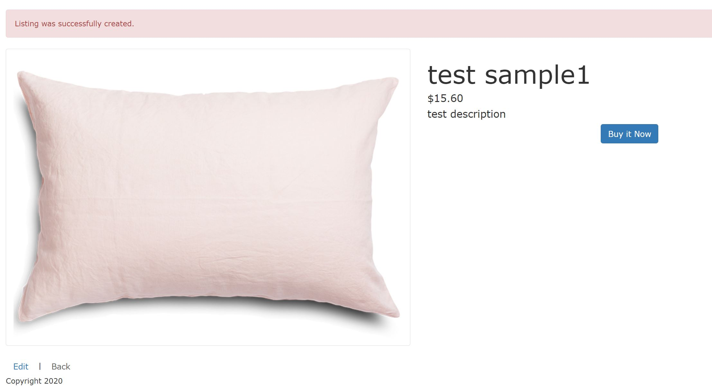
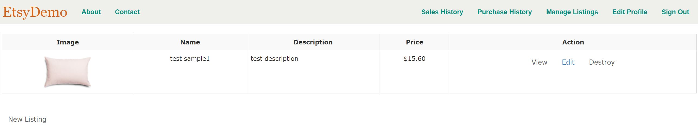
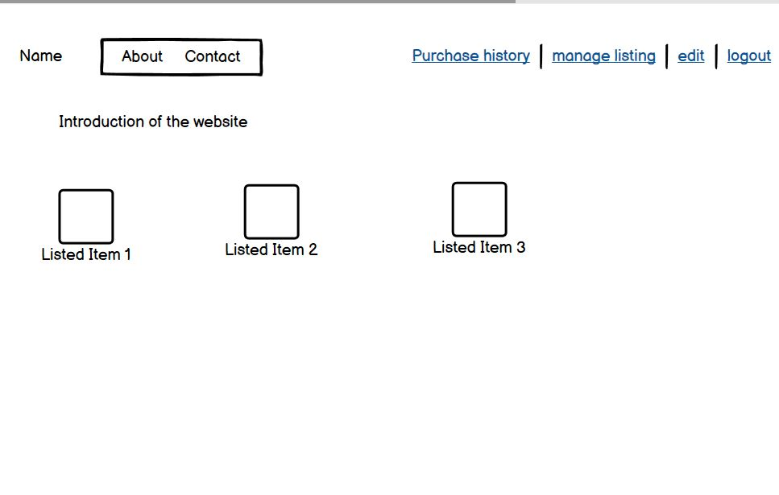
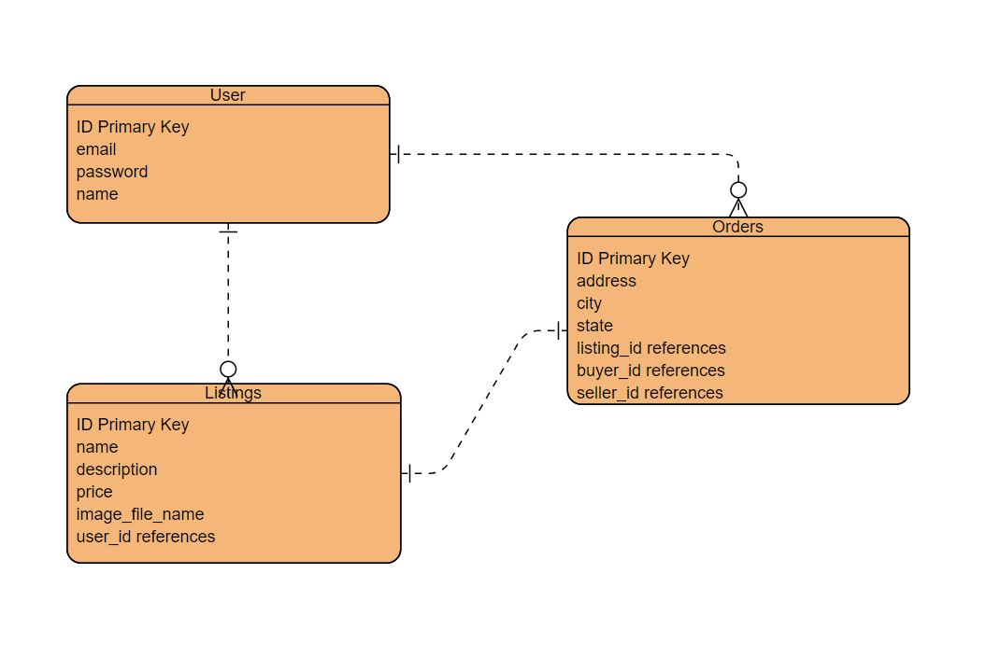
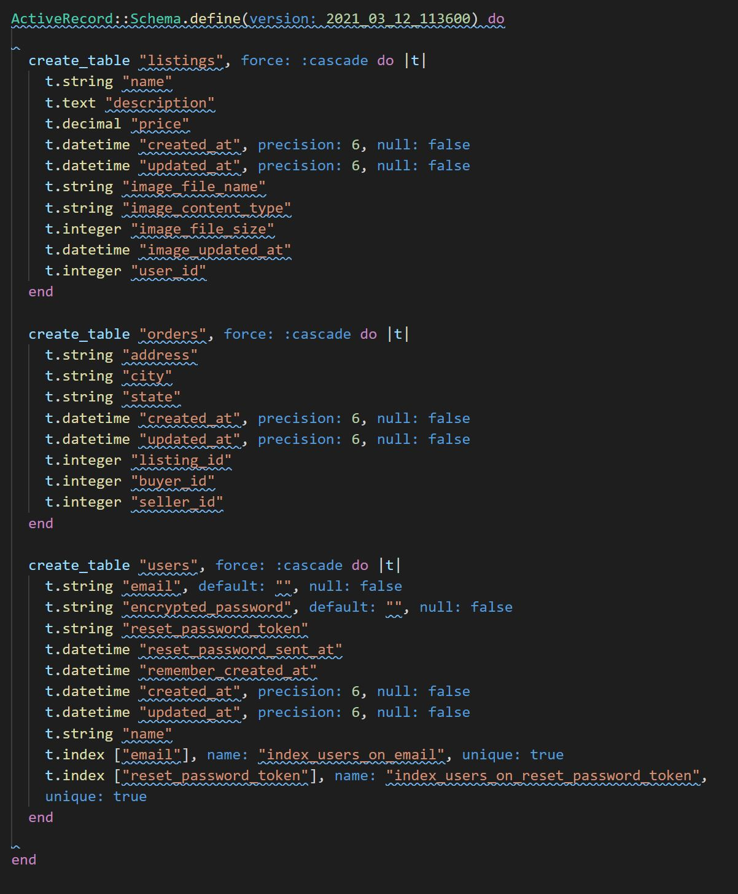

# README

## Identification of the problem you are trying to solve by building this particular marketplace app and Why is it a problem that needs solving?

People now need a one-stop Ebay like website to sell their spare items, and buy 2nd hand daily necessities supplied by other users. In the website, an individual user could be both buyer and seller as they can use their account to upload items for sell, and use the same account to order items they want to buy.

## A link (URL) to your deployed app (i.e. website)

The application has been deployed to: https://etsydemo-haden.herokuapp.com/

## A link to your GitHub repository (repo).

Github link: https://github.com/haden-liu/etsydemo1

## Description of your marketplace app (website), including:

- Purpose:
  provide a one-stop platform for users to exchange their items.
- Functionality / features:
  Customer can sign up as a user. After the sign up, the user can create the new listing for product, and the new listing will belong to user's account. And the user can edit or remove the items using the functions under the manage listing page. User can make order for the product, and they can view the sales history and purchase history in the web.
- Sitemap
  
- Screenshots
  
  
  
  
- Target audience
  Individual sellers and buyers who need to exchange their spare items.
- Tech stack (e.g. html, css, deployment platform, etc)
  - HTML
  - CSS
  - Ruby on Rails
  - Postgresql
  - Paperclip (to hold image)
  - Devise (to varify user information)
  - Stripe (to manage credit card pay, on development)

## User stories for your app

As a potential seller of the marketplace application, I want to sign up an account for the application and sign in with my account, so that I can access all features of the marketplace using my own account.

As a potential buyer, I want to view through all listed items and click to item image to go to the item details, so I can view the items in detail.

As a buyer, I want to create order so that I can make order to my preferred product.

As a buyer, I want to see my purchase history to keep my order records.

As a seller, I want to upload details of my items into the web so I can let other users know my available item.

## Wireframes for your app

## An ERD for your app

## Explain the different high-level components (abstractions) in your app

The app has built based on the MVC (model, view and controller) framework. the Models handle the relationship among database entities. And the views handle the display of the web contents. And the controllers handle the functions allow users to interact with the application.

The app uses Devise to manage the user's authentication with user's sign up, access and format requirements.

## Describe your projects models in terms of the relationships (active record associations) they have with each other

So far, the app has three main model classes: user, listing, and order.

In term of the relationship, a user could have none to many listings, and each listing must belongs to one particular user. And a user could have non to many orders, and each order must belong to a user, and associated with one item.

## Provide your database schema design

